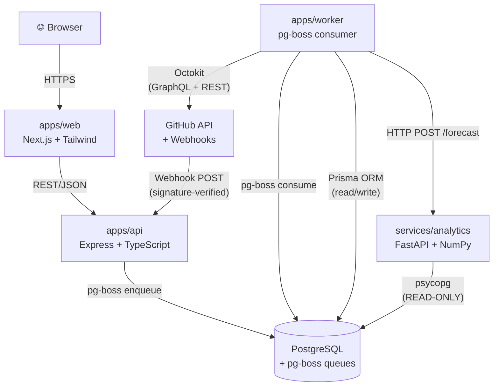
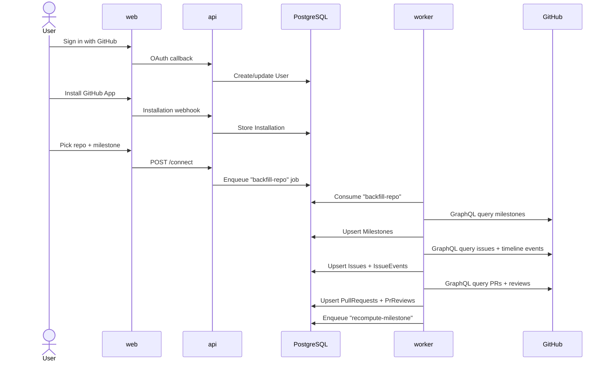
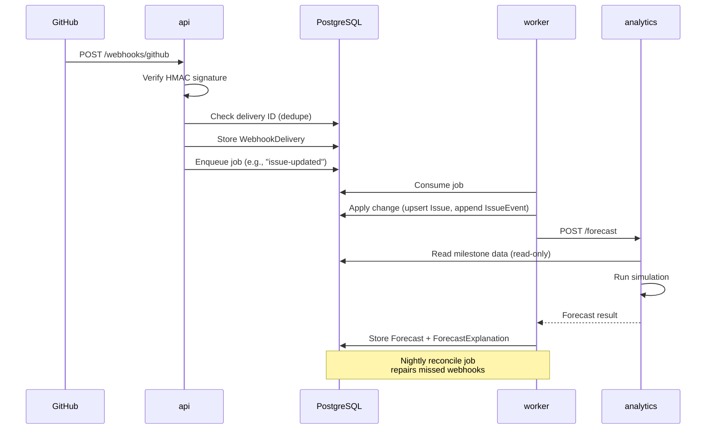
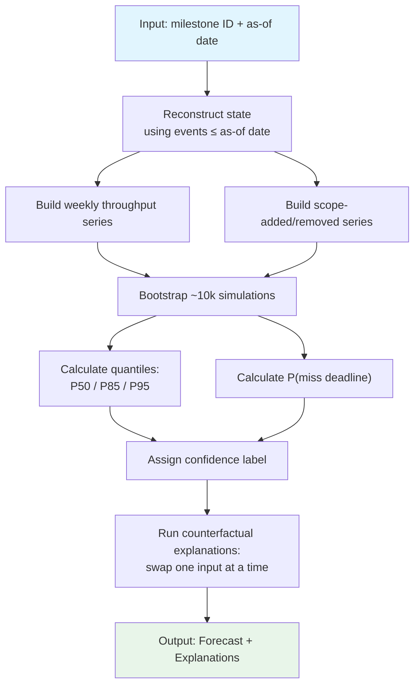
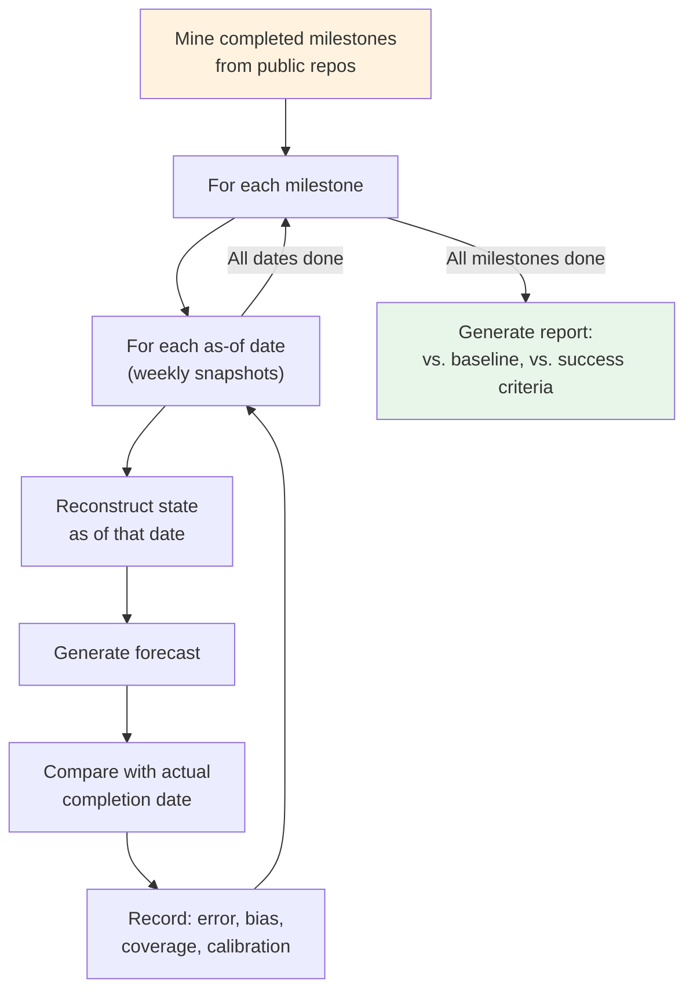

# Architecture

## Module Diagram

## Communication Table

| From | To | Protocol | Purpose |
|------|----|----------|---------|
| Browser | web | HTTPS | User interface |
| web | api | REST/JSON | API calls (proxied in production) |
| GitHub | api | HTTPS POST | Webhook deliveries (signature-verified) |
| api | PostgreSQL | pg-boss | Enqueue background jobs |
| worker | PostgreSQL | Prisma ORM | Read/write data |
| worker | GitHub | Octokit (GraphQL/REST) | Fetch milestones, issues, events, PRs |
| worker | analytics | HTTP POST | Request forecast computation |
| analytics | PostgreSQL | psycopg (READ-ONLY) | Read data for analysis |

### Security Boundaries

- **analytics** connects with a read-only PostgreSQL role (`analytics_reader`) — it can never modify data
- **Webhooks** are verified using GitHub's HMAC-SHA256 signature before processing
- **The frontend never calls GitHub or analytics directly** — all requests go through the api

## System Flows

### 1. Connect and Backfill

### 2. Live Update (Webhooks)

### 3. Forecast Pipeline

### 4. Backtest (Offline)

## Database Overview

The schema is managed by Prisma (`packages/db/prisma/schema.prisma`). Key models:

| Model | Purpose | Unique Key |
|-------|---------|------------|
| User | GitHub user who connected | `githubId` |
| Installation | GitHub App installation | `githubId` |
| Repository | Connected repository | `githubId`, `fullName` |
| Milestone | GitHub milestone | `(repositoryId, githubId)` |
| Issue | GitHub issue | `(repositoryId, githubId)` |
| IssueEvent | Timeline events (opened, closed, milestoned, etc.) | `githubId` (BigInt) |
| PullRequest | GitHub pull request | `(repositoryId, githubId)` |
| PrReview | PR review | `githubId` |
| WebhookDelivery | Deduplicated webhook | `deliveryId` |
| Forecast | Forecast result at a point in time | Indexed on `(milestoneId, asOfDate)` |
| ForecastExplanation | Counterfactual explanation | FK to Forecast |
